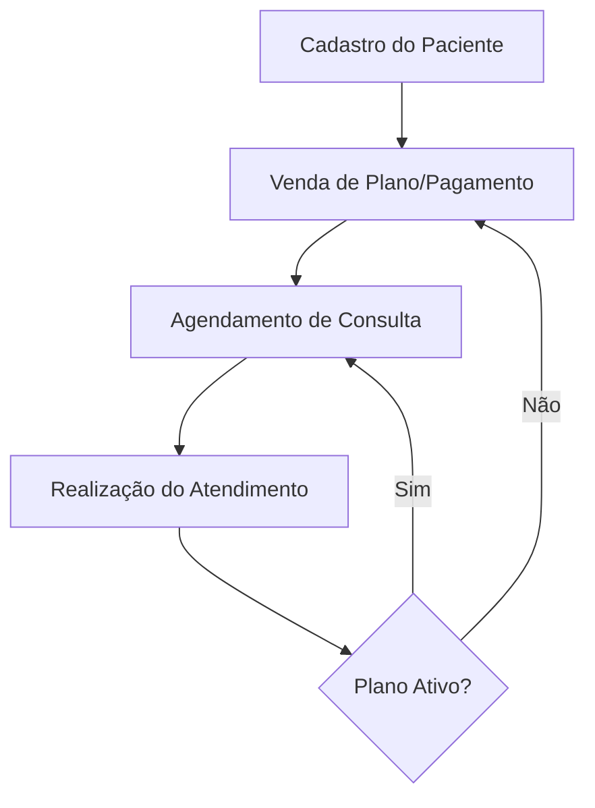

# Fluxos de Processo (Negócio)

Este documento detalha os fluxos lógicos e regras de negócio implementadas no sistema Aliada.

## 🔄 Fluxo de Ciclo de Vida do Paciente

## 💵 Regras de Distribuição Financeira

Cada Plano de Saúde (`HealthPlan`) possui dois percentuais configuráveis:
- **Percentual Médico**
- **Percentual Nutricionista**

Ao registrar um Pagamento (`Payment`), o sistema calcula automaticamente os valores devidos para cada área, facilitando o fechamento de caixa e o repasse para os profissionais.

**Exemplo:**
- Plano: R$ 500,00
- % Médico: 60% (R$ 300,00)
- % Nutri: 40% (R$ 200,00)

---

## ⏳ Lógica de Expiração de Planos

A validade de um atendimento é baseada na **data do último pagamento** somada aos **dias de validade do plano**.

- **Alerta Visual:** O sistema exibe um status de "Aviso" (cor amarela) quando faltam 20 dias ou menos para o vencimento.
- **Bloqueio Lógico (Opcional):** Pacientes com status "Expirado" são sinalizados no dashboard para que a secretaria realize a renovação antes do próximo atendimento.

---

## 📈 Histórico Clínico

Diferente de sistemas de agenda comuns, as consultas na Aliada são cumulativas. Isso permite:
- Comparar o peso atual com a consulta anterior.
- Acompanhar a evolução do percentual de gordura.
- Visualizar todas as prescrições anteriores em uma única linha do tempo.
