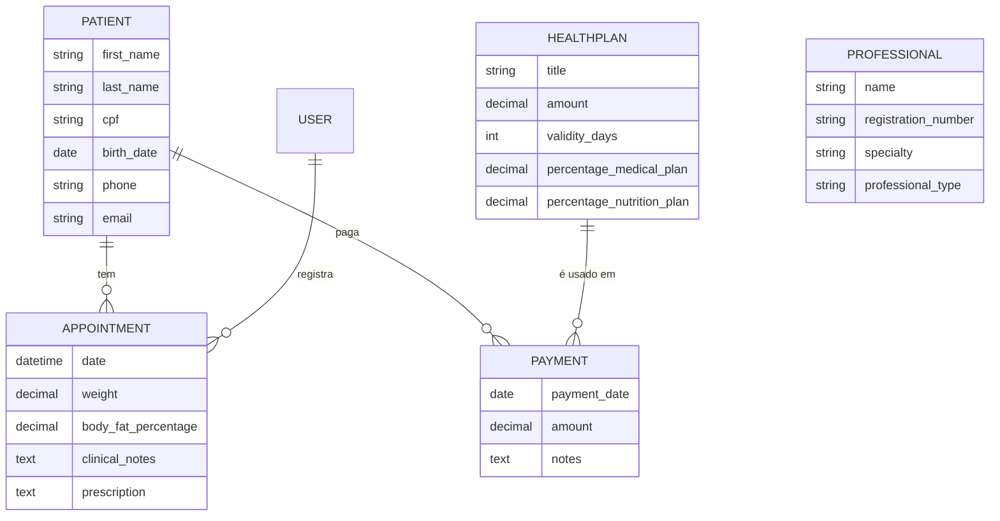

# Dicionário de Dados e Banco de Dados

O sistema utiliza **PostgreSQL** (em produção) e **SQLite** (em desenvolvimento local), gerenciado pelo Django ORM.

## 📊 Modelo de Entidade e Relacionamento (ER)

## 📝 Descrição das Tabelas

### 1. Pacientes (`clinic_patient`)
Armazena os dados cadastrais dos clientes da clínica. O campo `CPF` é único e obrigatório para evitar duplicidade.

### 2. Consultas (`clinic_appointment`)
Registra cada atendimento realizado. Além da data, armazena dados clínicos importantes como Peso, Percentual de Gordura e a Prescrição médica/nutricional.

### 3. Profissionais (`clinic_professional`)
Cadastro de médicos e nutricionistas, incluindo seus registros profissionais (CRM/CRN).

### 4. Planos de Saúde (`clinic_healthplan`)
Define os pacotes de serviços vendidos aos pacientes. Controla a validade (em dias) e como o valor pago é distribuído entre os profissionais (percentuais).

### 5. Pagamentos (`clinic_payment`)
Vincula um Paciente a um Plano. Calcula automaticamente a data de expiração baseada nos `validity_days` do plano.
- **Status de Pagamento:**
    - `active`: Dentro da validade.
    - `warning`: Menos de 20 dias para expirar.
    - `expired`: Fora da validade.
